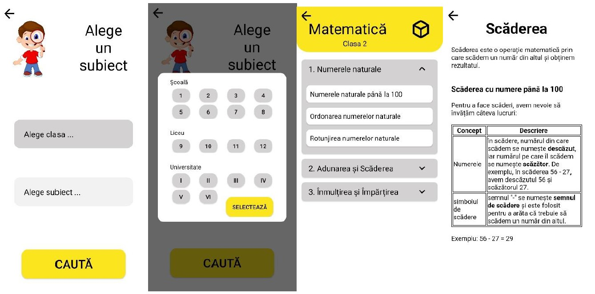

# DigiBrain

## Description

This app aims to meet the needs of pupils and students by giving them access to educational resources from anywhere and at any time, with materials of various types including text, graphics and interactive tests, as well as learning plans created by other teachers, who have the ability to create their own learning resources for app users.

This project represents the development of a mobile app for the field of education that provides learning materials, interactive tests and personalized learning plans for the Android platform, being created using the Kotlin programming language and Model View ViewModel as architecture. All the information used is dynamic and an API developed using the .NET Core framework in Model View Controller architecture is used to manipulate it. Given that the information is dynamic, it was considered a good idea to create an administration website for teachers and administrators, developed using the ReactJS framework.

## System functionalities

### Mobile App functionalities

### Administration Page functionalities

## System Architecture

The project can be devided in 4 categories of coponents:

 - Server
 - Data
 - Apps
 - Services

### Server

The server is the main component of the architecture and is built in .NET Core 5 with C#. It is built as an API that provides a set of endpoints to communicate with other applications. It is used by those mobile app and admin web page and provides GET, POST, PUT and DELETE services linking data and services. It was deployed using docker on an EC2 instance on AWS so that it can be accessed from anywhere.

### Data

The second category, data, is made up of 2 components, database and object storage. The database is PostgreSQL (SQL-like) and is a well-organised, structured system where data is stored in a tabular format with rows and columns. It allows relational data to be structured and queried. As can be seen in Figure 4.1, the relationship between the database and the server is bidirectional, in that the server can modify data in the database using the POST, PUT and DELETE operations, but can also query using the GET operation.

The second component categorized in the data category, object storage, is a non-relational approach to data management that is based on the concept of objects. This method of data storage is often used for large data such as images, audio files, videos, documents and other unstructured types of files. In this project the S3 service offered by AWS is used and is used to store user profile images. It can be seen from the architecture diagram that the communication method is different from the database method. The saving part of the images is done through the server using an access key with write permissions for security, and the downloading part of the files is done directly from the application on the object storage server using an access key with read permissions to reduce server traffic and reduce costs. This approach is based on the fact that saving/editing profile images is much less frequent than accessing them from the application.

### Apps

The mobile app is the most important component of the architecture, it is the app that provides students and learners with all the functionality presented. It offers an interactive and easily accessible interface that supports students in their learning and academic development through access to educational materials and resources, the possibility to give quizzes, the possibility to follow learning plans created by teachers and view statistics. It was created using the Kotlin language in Android Studio, Android being the only platform that supports the app. As for the links with the other components, it is connected with the server using API calls, it is linked to the object storage by directly accessing the profile images of users using a passkey with read permissions, but it is also connected with the notifications component.

The administration web page is a component for administrators and teachers, through which they can add, modify or delete educational materials, topics, questions and learning boards for pupils and students. It was chosen to create such a component in order to make it easier for administrators and teachers because it was quite difficult to do these activities if they were implemented in the mobile app. React Js was used for the development and it was deployed on an EC2 server to be accessible from anywhere.

### Services

The service category provides additional functionality offered by the server via the API. The 2 components that fall into this category are the email service and the notification service. The email service is used to confirm the account on the creation side. It will send a confirmation email through which the user can activate their created account. For this, the email service offered by AWS, namely Simple Email Service, was used.

The notifications component is used to send notifications to the mobile app. For this project Firebase Cloud Messaging offered by Firebase was chosen which offers the possibility to send notifications based on topics. The communication consists of 2 parts, to send a notification a specific server endpoint is used which sends a message to a specific topic. In order for these to be received on the phone, this is where the other part of the communication comes in, and for this the mobile app needs to be configured to intercept notifications sent by the messaging service.

## Mobile App design

### User specific pages

### Subjects and Lessons pages

### Quiz pages

### Learning Paths pages

